# Identify Fraud from Enrom Email

## Introduction

### The Problem

The [Enron scandal](https://en.wikipedia.org/wiki/Enron_scandal) is one of the most significant corruption episodes in the United States of American history. Enron's senior executives such as [Jeffrey Skilling](https://en.wikipedia.org/wiki/Jeffrey_Skilling) and [Kennet Lay](https://en.wikipedia.org/wiki/Kenneth_Lay) were systematically involved in illegal schemes aiming to greedily improve profits and power over different sectors in the North American society. These illegal acts ultimately led to the bankruptcy of the [Enron Corporation](https://en.wikipedia.org/wiki/Enron) in October 2001.

This report will explore a dataset containing Enron former employees' financial and email data. The main goal is to come up with a machine learning model able to efficiently classify the employees as a Person of Interest (POI) probably involved in the corruption mechanism. Different classification models will be trained and tested, checking their performances metrics, and, optimizing their hyperparameters.

### The Data

#### Structure

The dataset is composed of 146 observations, 20 features and the target "poi", which is a boolean variable. The features can be divided into two classes:

**Financial Data:** 'salary', 'deferral_payments', 'total_payments', 'exercised_stock_options', 'bonus', 'restricted_stock', 'restricted_stock_deferred', 'total_stock_value', 'expenses', 'loan_advances',  'other',  'poi', 'director_fees', 'deferred_income', 'long_term_incentive'

**Email Data:** 'to_messages', 'from_poi_to_this_person', 'shared_receipt_with_poi', 'from_messages', 'from_this_person_to_poi', 'email_address'

#### Target Balance

The target is the boolean column "poi". Each employee is classified as a POI (True) or non-POI (False). The following bar plot illustrates how theses two classes are balanced in the dataset.

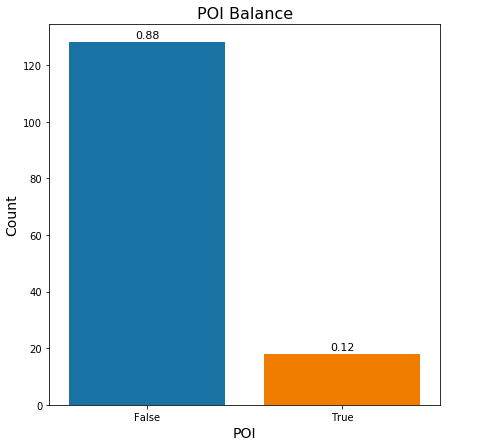

As shown in the previous plot, the "poi" target is highly sparse. Only 12% of the observations are labeled as POIs, totalizing 18 out of the 146 observations. This characteristic is important, given that it will influence the classification models evaluation metrics and the hyperparameters as well.

#### Outliers

During the data exploration, it was detected some outliers. The most prominent one was the observation "TOTAL" related to the sum of the other observations. Because of that, it was removed from the dataset.

Other outliers were observed consistently. For instance, the following Boxplots shows the outliers detected in the "salary" feature.

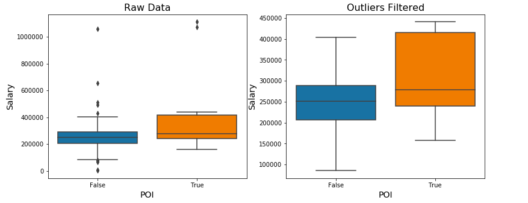

And the following Pandas Data Frame lists the employees with the highest salaries.

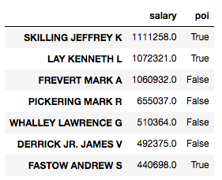

The two highest salaries belong to POIs. Thus, these outliers, differently from the "TOTAL" outlier, should not be removed, once they mostly are related to POIs.

It is important to notice that, this machine learning model rely on detecting aberrant observations, the POIs. An average Enron employee most probably will not be involved in the corruption schemes. This way, to remove any detected outlier without closer inspection is not a good idea as it may end up on losing important training data for the machine learning models.

#### Data Sparsity

Besides the outliers innate characteristic, the dataset also presents high sparsity in some features. Using [missingno](https://github.com/ResidentMario/missingno) library, it was produced the following plot. Larger bars mean denser features, and smaller bars mean more sparse features.

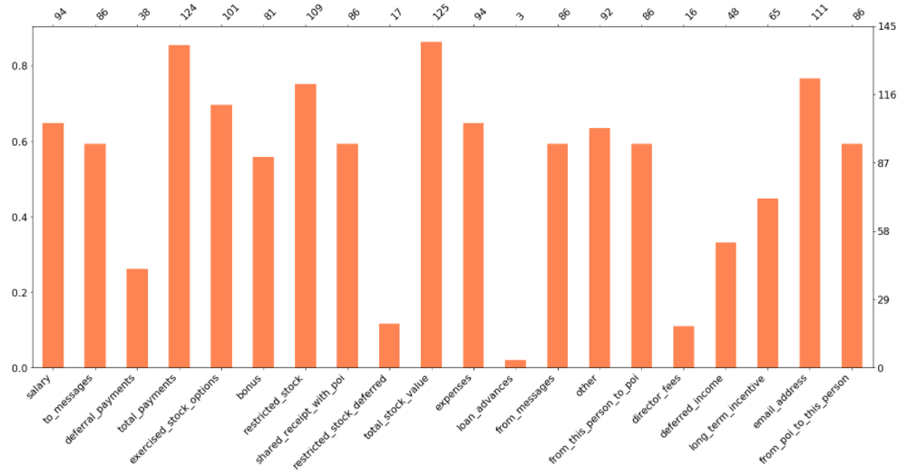

The features "loan_advances", "director_fees" are highly sparse. Less than 20% of the observations possess these attributes. Only 3 out of the 146 observations hold a "loan_advance" value and 16 hold a "director_fees" value.

#### Email Feature

It is expected that a person's e-mail address to be unique. Consequently, this feature will probably not help much in the classification problem. Because of that, it was removed from the Dataset.

## Feature Selection

### Feature Engineering

Three ratio features were created:

* ratio between 'from_messages' and 'from_this_person_to_poi';
* ratio between 'to_messages' and 'from_poi_to_this_person';
* ratio between 'to_messages' and 'shared_receipt_with_poi'.

The reason for these creations is that the features 'from_this_person_to_poi', 'from_poi_to_this_person' and 'shared_receipt_with_poi' do not give the proportion of the engagement level between the observed person and a POI. For example, an employee may receive many emails from either POIs or non POIs. This is a different engagement level from an employee that receives most of the emails from POIs. So, a new feature describing these proportions may help the machine learning models in identifying the POIs correctly.

### Features *k* Scores

After the feature engineering stage, the features' *k* scores were evaluated. The results obtained are disposed on the following plot.

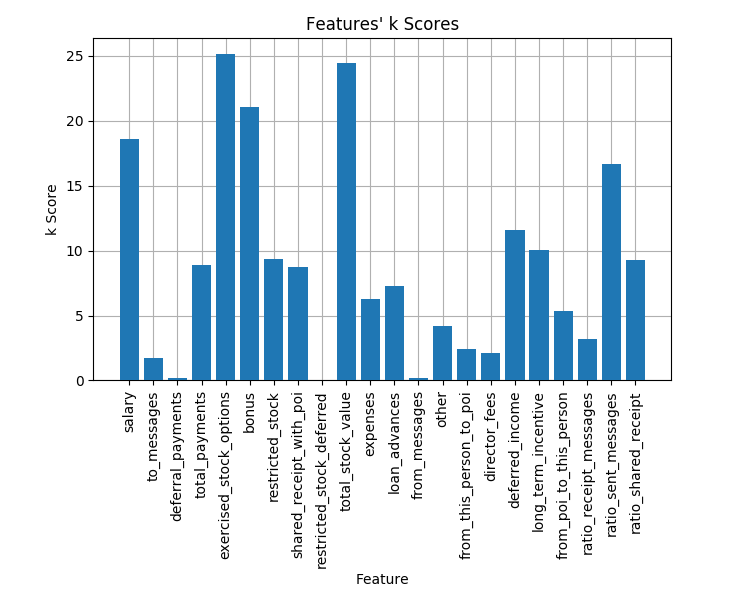

The feature 'ratio_sent_messages', ratio between 'from_messages' and 'from_this_person_to_poi', presented the best score among the new features, being the fifth feature with the highest score. The other two features did not perform so efficiently, but I decided to keep them during the model's evaluation, so it was possible to experiment with a vast number of features.

### Defining Feature Sets   

In order to experiment with a variety of input spaces, the features were divided into four sets:

* **all**: all features considered;
* **feature set 1:** 'loan_advance', 'director_fees' and 'total_stock_value' excluded. The features 'loan_advance' and 'director_fees' were excluded because they are highly sparse. The feature 'total_stock_value' was discarded because it is 96% linearly correlated with the feature 'exercised_stock_options';
* **feature set 2:** in addition to the features removed in the feature set 1, the features 'deferred income' and 'deferral_payments' are disregarded as well. These features are also very sparse: less than 40% of the observation possess a value for these features.
* **feature set 3:** this set was obtained empirically testing the models against a variety of features list. The features list which presented was stored in this set. The methodology to achieve this results will be explained in the following sections.

## Machine Learning Models

### Models Chosen

Four machine learning models were tested:

* [Decision Tree classifier](http://scikit-learn.org/stable/modules/generated/sklearn.tree.DecisionTreeClassifier.html);
* [Linear SVC](http://scikit-learn.org/stable/modules/generated/sklearn.svm.LinearSVC.html);
* [Random Forest classifier](http://scikit-learn.org/stable/modules/generated/sklearn.ensemble.RandomForestClassifier.html);
* [SVC](http://scikit-learn.org/stable/modules/generated/sklearn.svm.SVC.html).

### Metrics and Evaluation Chosen for Evaluation

Considering that the target is unbalanced, the accuracy metric may be misleading. For instance, if the model efficiently identifies non-POIs, but poorly identifies the POIs, it could still present a high accuracy performance, but the main goal, to predict correctly the POIs, is not being achieved. This way, different evaluation metrics should be considered to reach the principal objective. In this context, the metrics precision and recall present themselves as better solutions than the accuracy.

The precision will measure the proportion of the number of true positives and the total number of positives, considering false positives. In the problem scope, the precision will inform the probability of a person truly be a POI given that it was detected as one. This is an important fact as the model should not be unfair charging incorrectly a person as a POI.

The recall will measure the proportion of the true positives and the sum of true positives with the false negatives. In other words, the recall will describe the capacity of the machine learning model to detect true positives. Given that a person is a POI, what is the probability of the model to detect it? That is the question that the recall metric seeks to answer.

In summary, the classification model ideally should present decent precision and recall metrics. As a threshold, they must have precision and recall metrics higher than 0.3. The [F1 score](https://en.wikipedia.org/wiki/F1_score) comes in hand here, once it is a balance between precision and recall.

In order to obtain those metrics, the models were evaluated using StratifiedShuffleSplit with 1000 folds. During the GridSearchCV and RandomizedSearchCV stage, it was used the default evaluation strategy, StratifiedKFold with 3 folds.

The machine learning models' evaluation is important, given that it helps to avoid typical problems such as high bias or high variance on the classifiers. Testing the model with different datapoint, also know as test data, instead of using the same train datapoint will detect if the machine learning is overfitted, performing well for the train data and poorly for the test data. In other words, the validation will inform how efficiently a machine learning model can generalize for different data. In this matter, the StratifiedShuffleSplit is a good solution as it provides a vast number of train and test sets even from small datasets, like the Enron dataset.

### Feature Scaling

The features were scaled used MinMaxScaler, because some models consistently perform better utilizing this approach, according to the "Tips on Practical Use" section on the [sklearn SVM documentation page](http://scikit-learn.org/stable/modules/svm.html).

### Baseline Model

#### Using All Features as Input Space

Initially, a Decision Tree Classifier with all default parameters and all features was tested in order to set a benchmark score for the following models. It is not expected from this model to achieve a good performance as its main purpose is to set an initial mark for the remaining models.

The following table presents the obtained results:

| Precision     | Recall        | F1      | F2      |
| ------------- |:-------------:| -------:| -------:|
| 0.21189       | 0.20500       | 0.20839 | 0.20634 |

As expected, the Baseline model did not achieve the 0.3 mark.

#### Testing With Different Features List

Posteriorly, the baseline model was tested with different input spaces. The feature list was selected by the K Best algorithm varying the k parameter from 1 until the total number of features. The feature set 2 was applied to the K Best algorithm as input. The metrics evaluated for each model were stored, and they are displayed in the following plot.
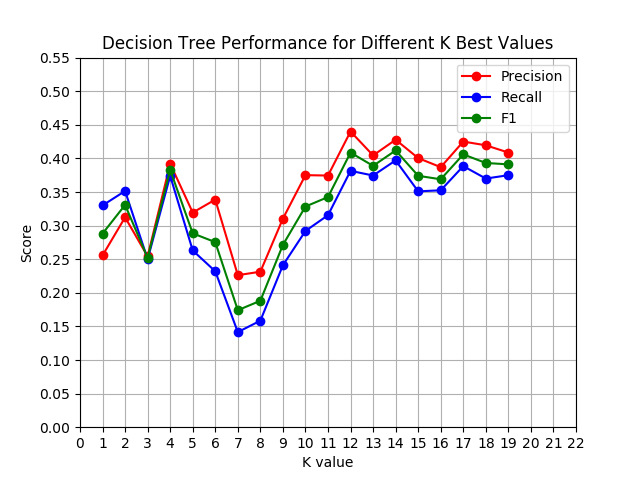

The performance for some K values has increased, surpassing the 0.3 threshold. It is also possible to notice that the Decision Tree tend to perform better using more features.

### Machine Learning Models Performance Varying K Value

#### Methodology

The same strategy described in the previous section was applied to the four machine learning models. However, in addition to the feature set with all features, the feature sets 1 and 2 were used as input for the KBest algorithm as well. The results obtained are presented in the following section. The model's parameters were set to default.

#### Results

|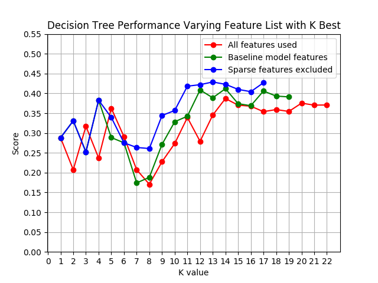|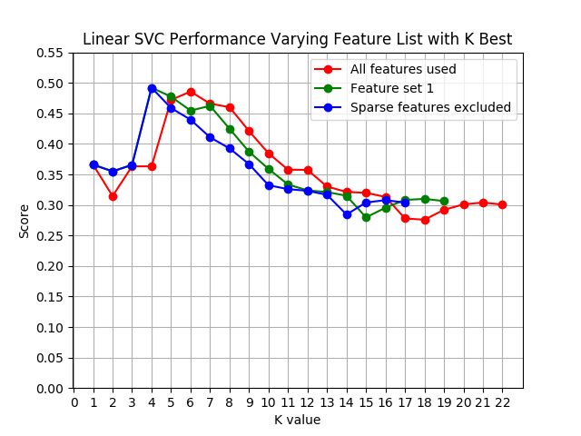|
| ------------- |:-------------:|
| 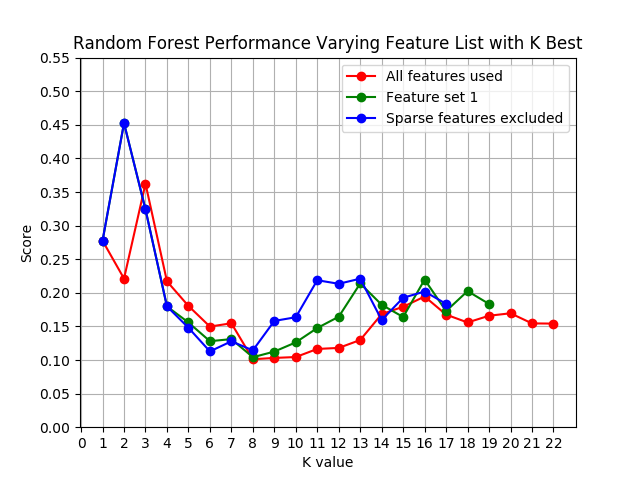|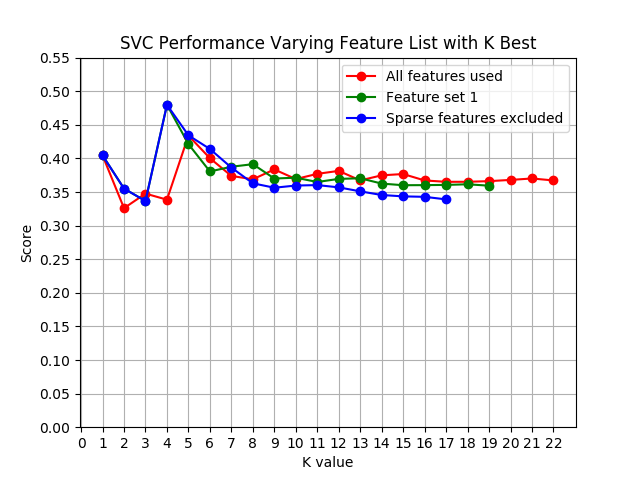       |

Visually, it is possible to notice that the Linear SVC has achieved the best performance with 0.5 F1 score using the four best features and feature set 2, according to the k score. Overall, the SVC showed a more stable performance around 0.4 F1 score.

#### Performance Comparison Between the Models

The following plots show the performance comparison between the models for each feature set used.

|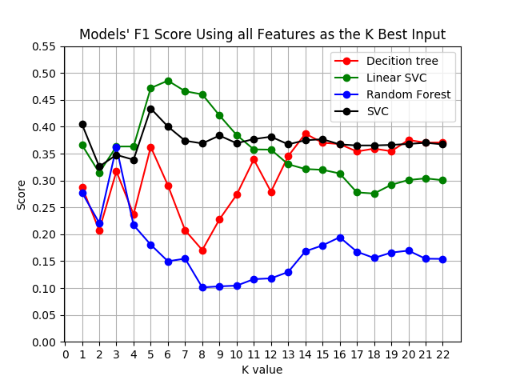|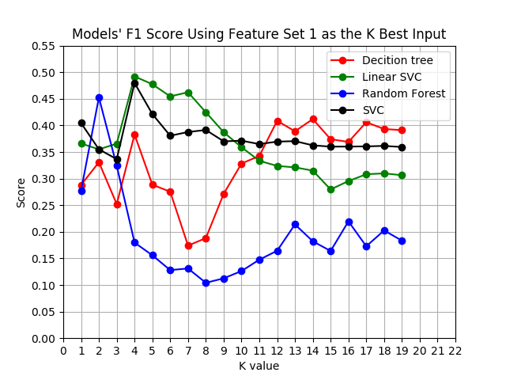|
| ------------- |:-------------:|
|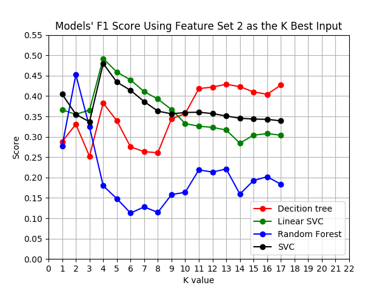|

Although the results were satisfactory, greater than the 0.3 threshold, it is important to tune the so-called models' hyperparameters because, this way, the models' out-of-box performance may be potentialized for different parameters settings. However, tuning too much the parameters may cause the model to have a high variance on the train and test data. Soon, little tuning may led to high bias and over tuning, to high variance. [This reference](https://dswalter.github.io/blog/overfitting-regularization-hyperparameters/) has a didactic explanation about this tuning trade-off. The following section will tune the models' hyperparameters.

The features list with the best result, using the feature set 2 as input space (third plot), were stored as the feature set 3. This set will be used in the following section during the hyperparameters optimization.

### Hyperparameters Optimization

#### Methodology

The four machine learning models were optimized using [GridSearchCV](http://scikit-learn.org/stable/modules/generated/sklearn.model_selection.GridSearchCV.html) and [RandomizedSearchCV](http://scikit-learn.org/stable/modules/generated/sklearn.model_selection.RandomizedSearchCV.html). The computationally expensive models Random Forest classifier and SVC were optimized through RandomizedSearchCV as this method is less exhaustive than the GridSearchCV. The remaining models Decision Tree classifier and Linear SVC were optimized using GridSearchCV. Bear in mind that, according to [this study](http://scikit-learn.org/stable/auto_examples/model_selection/plot_randomized_search.html), the performances utilizing both optimization methods are pretty similar.

Each machine learning model was optimized for three different input spaces: all features, feature set 2 and feature set 3. The results are presented in the following section in plots and a table. Also, for the feature set 2 and all features, the optimization methods tested for different PCA dimensionality reductions, varying from 1 principal component to 10 principal components. No K Best reduction was applied in these cases. For the feature set 3, neither PCA or K Best was applied, considering that the feature list defining feature set 3 was obtained during the test with different k values.

#### Parameters Tuned

The following table lists the parameters tuned for each model during the GridSearchCV or RandomizedSearchCV execution. In addition to these parameters, the number of principal components for the PCA algorithm was also tuned. The classifier with the best results and the respective parameters was stored in a pickle file.

| Model     | Parameters Tuned        |
| ------------- |:-------------:|
| Decision Tree| max_depth, min_samples_split, min_samples-Leaf, min_impurity_split      
| Linear SVC | penalty, C, class_weight |
| Random Forest Classifier | n_estimators, bootstrap, class_weight, max_depth, min_samples_split, min_samples_leaf, min_impurity_split|
| SVC | class_weight, C, kernel, gamma, coef0 |

#### Results

 |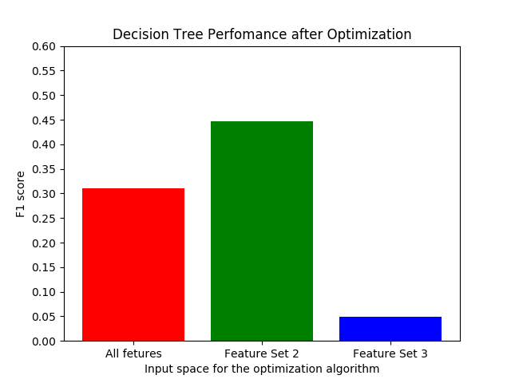|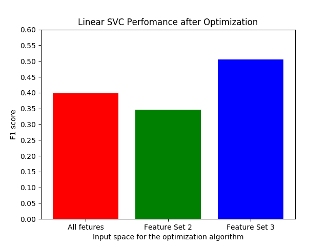|
 | ------------- |:-------------:|
 | 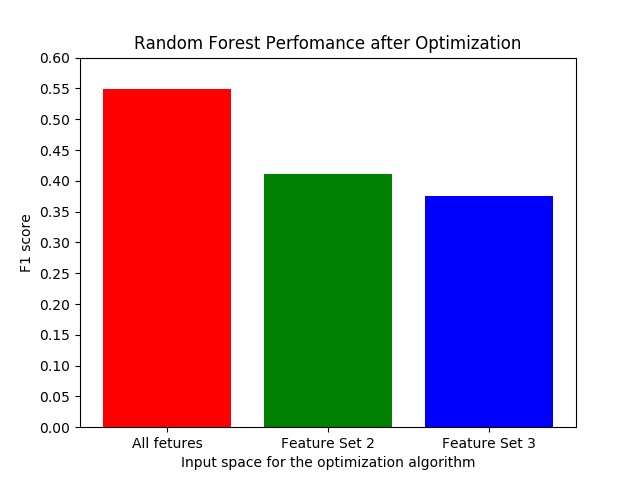|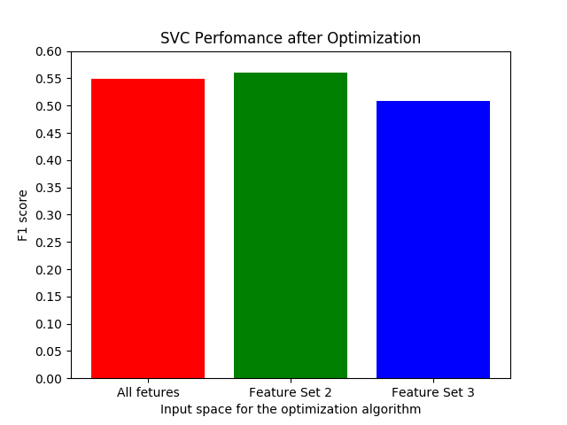       |

 The best F1 score and the remaining related metrics for each model are distributed in the following table.

 | Model                    | Features List|Precision     | Recall        | F1      | F2      |
 | -----                    | :----: |:-----------: |:-------------:| -------:| -------:|
 | Decision Tree Classifier | Feature Set 2| 0.48400       | 0.41600       | 0.44743 | 0.42803 |    
 | Linear SVC               | Feature Set 3| 0.40088       | 0.68150       | 0.50481 | 0.59781 |   
 | Random Forest Classifier | All features | 0.47810       | 0.64400       | 0.54879 | 0.60221 |
 | SVC                      | Feature Set 2| 0.48881       | 0.65550       | 0.56002 | 0.61365 |

### The Chosen One

The best performance was achieved with the SVC after the RandomizedSearchCV, as demonstrated in the previous section. Because of that, this model was chosen to solve the proposed problem of identifying POIs. The model was dumped through the scripts poi_id.py and tester.py in the pickle file "my_classifier.pkl", which holds the parameters defined for this classifier.

The following table offers a brief of description of the best classifier.

| Model     | Features List        | Scale      | Dimensionality Reductions     |
| ------------- |:-------------:| -------:| -------:|
| SVC       | Feature Set 2       | MinMaxScaler | PCA, 1 principal component |
